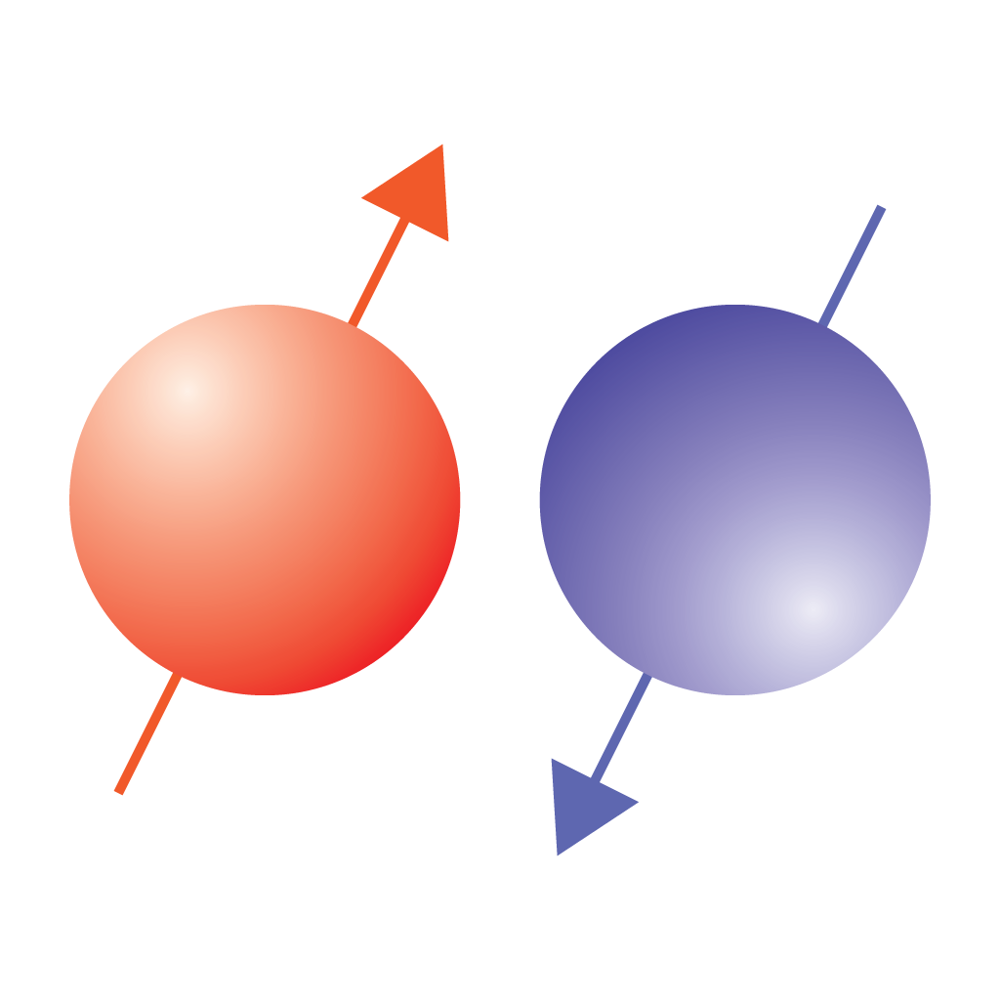

# NMR Calculator

You may clone or download the source from the GitHub [repository](https://github.com/jaeseung16/NMRCalculator).

[Send us an email.](mailto:jaeseung@gmail.com?subject=RE:%20NMR%20Calculator%20Inquiry)

## Description

The app evaluates the values of some basic parameters used in nuclear magnetic resonance (NMR) spectroscopy.

### Nucleus
- Select an isotope with non-zero nuclear spin to find out its nuclear spin, gyromagnetic ratio, and natural abundance.
- For a chosen isotope, its Larmor frequency at a specified external magnetic field together with the Larmor frequencies of the proton and free electron will be shown.
- One can change any of the Larmor frequency, external magnetic field, and proton’s Larmor frequency to find out the other two.
- (**iPhone, iPad**) The information on the chosen isotope can be searched in Safari by pressing the "Search Web" button.

### Signal
- One of the number of data points, duration, and dwell time for signal acquisition is calculated when two of them are given.
- One of the number of data points, spectral width, and frequency resolution for a NMR spectrum is calculated when two of them are given.
- (**iPhone, iPad**) One of the items can be deactivated by tabbing the corresponding label. While deactivated, the value will not be changed, and the calculation will be performed accordingly.

### RF Pulse
- One of the pulse duration, flip angle, and RF amplitude of a RF pulse is calculated when two of them are given.
- The difference between the power levels of two RF pulses is presented in dB.
- (**iPhone, iPad**) One of the items, except "RF power relative to 1st (dB)", can be deactivated by tabbing the corresponding label. While deactivated, the value will not be changed, and the calculation will be performed accordingly.

### Solution (iPhone, iPad)
- The concentration of a sample solution is calculated when the molecular weight and the masses of the solute and solvent water are given.
- The amount of the solute is calculated when the concentration is given.
- The name of chemical can be entered.

### Info (iPhone, iPad)
- The data source for NMR-enabled isotopes and formulas used in the app are presented.

### Enrst Angle (macOS)
- One of the repetition time, relaxation time, and Ernst angle is calculated when two of them are given.
- [Wikipedia](https://en.wikipedia.org/wiki/Ernst_angle)

#### History

- **1.3.2** Feb 10, 2020
  - Added WatchOS extension.
    - Search for an isotope with non-zero nuclear spin on your wrist!
    - Select an isotope and find out its Larmor frequency for a given external magnetic field or proton Armor frequency by using the Digital Crown.

- **1.3.1** Dec 2, 2019
  - Supports the dark mode in iOS 13

- **1.3** Apr 1, 2019
  - The selected nucleus is remembered and will appear in the next launch
  - The values entered in the 'Singal', 'RF Pulse', and 'Solution' scenes are remembered and will appear in the next launch

- **1.2** Nov 1, 2017
  - Corrected the names of some nuclei
  - Made consistent the vertical positions of the tabs

- **1.1** Sep 28, 2016
  - Nucleus
    - Added the Larmor frequency of a free electron in GHz.
    - Added the "Search Web" button to allow search the selected isotope on the web.
  - Signal
    - One of the items can be deactivated by tabbing the corresponding label. While deactivated, the value will not be changed.
  - Pulse
    - Added a new section to calculate the Ernst angle.
    - One of the items, except "RF power relative to 1st (dB)", can be deactivated by tabbing the corresponding label. While deactivated, the value will not be changed.
  - Info
    - Added the link to the source of the electron gyromagnetic ratio: http://physics.nist.gov/cgi-bin/cuu/Value?gammae
    - Added the formula for the Ernst angle.

- **1.0** Aug 24, 2016